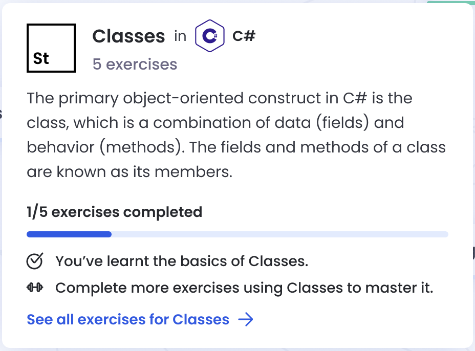

# Widgets

Concept and Exercise Widgets are used frequently throughout the site.
They look like this:


They also have user-contextual tooltips such as this:



You may like to render these widgets yourself in Markdown documents, for example at the end of a document to suggest extra reading or good exercises to learn something from.

**Note:** You can also use normal links for inline text, which will have the tooltips added. See [the Internal Linking documentation](./internal-linking.md) for more details.

## Usage

Widgets can be used wherever you can use Markdown, such as documentation, approaches and student/mentor discussions.

The link reference, i.e. the contents of `()`, is ignored by the website. You can point them at whatever you want for maintenance purposes.

## Concept widget

Link format: `[concept:<track-slug>/<concept-slug>]()`

### Example: list

```markdown
There are three primary conditional statements that are used in Julia:

- [concept:julia/if-statements]()
- [concept:julia/ternary-operator]()
- [concept:julia/short-circuiting]()
```

### Example: inline

```markdown
A ternary expression is an alternative to [concept:ruby/if-statements]().
```

## Exercise widget

Link format: `[exercise:<track-slug>/<exercise-slug>]()`

### Example: list

```markdown
Great job on solving this exercise! Some other exercises that you might also like to try:

- [exercise:fsharp/anagram]()
- [exercise:fsharp/isogram]()
```
