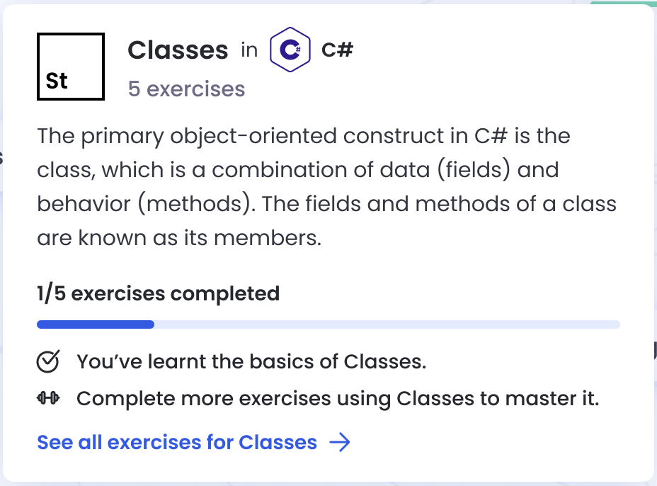

# Internal Linking

Links rendered via Exercism's Markdown parser are checked to see if they are internal, and if so may be decorated with tooltips.

A tooltip for a concept might look like this:

## Usage

There is no special syntax for links to be decorated in this manner.
Instead we check to see if the link href follows one of two forms:

- A URL. e.g. https://exercism.io/tracks/ruby/concepts/basics
- An absolute path. e.g. /tracks/ruby/concepts/basics

We do not currently support relative URLs (e.g. those beginning with `./` or `../`) because the Markdown parser is not aware of the context of the document it renders, the context it is rendering in, or the structure of a git repository.

## Alternatives

Rather than using normal links, you might like to render Widgets.
These are generally used at the end of a document to suggest extra reading or good exercises to learn something from.

See [the Widgets documentation](/docs/building/markdown/widgets) for more details.
