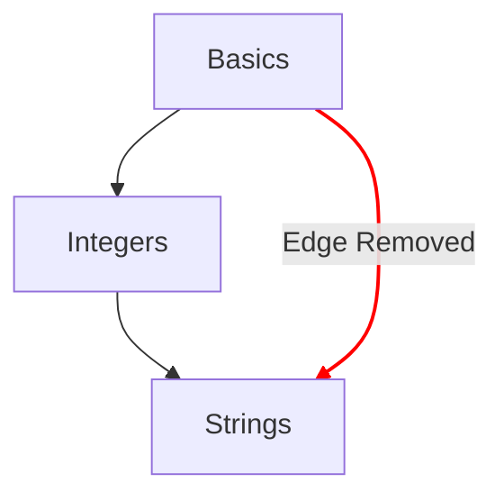

# Concept Map

The concept map is one of the main methods to illustrate the progression that a student takes through the concept exercises.

## Design Goals

- Provide a meaningful concept map of ideas from simple to complex ideas.
- Provide a pathway towards fluency in a language.
- Illustrate the progression through the course [track] contents.

## Structure

- Nodes
  - Each concept is represented by a node on the concept map.
  - Provide a quick reference with their style to indicate the degree of progression.
    - Mastered: Concepts whose learning exercise and all associate practice exercise is complete.
    - Complete: Concepts whose learning exercise is complete, but one or more practice exercise is not complete.
    - Available: Concepts whose learning exercise has not been completed.
    - Locked: Concepts whose learning exercise requires one or more pre-requisite exercise to be completed.
- Paths
  - Provide a relation of one concept to the next.
  - Provide a relation indicating the building blocks of a concept back to the root.

## Configuration

The configuration of the concept map is determined by details of the `config.json` associated to a track.
Specifically the specification of the concept exercises determines the shape and layout of the concept map.

> You can view the code used to compute the concept map specification on GitHub: [Exercism/website: determine_concept_map_layout.rb][github-concept-code]

A concept exercise specifies its prerequites and also the concept it teaches on completion.
If we translate this to the terms of a [graph][wikipedia-graph]:
- A concept represents a _vertex_ (also known as a _node_)
- A concept exercise determines one or more _directed edges_ between two _vertices_ (_nodes_)

It is important to note, not all edges that could be specified from the `config.json` appear in the result -- only the edges from the preceeding level are selected.

[github-concept-code]: https://github.com/exercism/website/blob/main/app/commands/track/determine_concept_map_layout.rb
[wikipedia-graph]: https://en.wikipedia.org/wiki/Graph_(discrete_mathematics)
